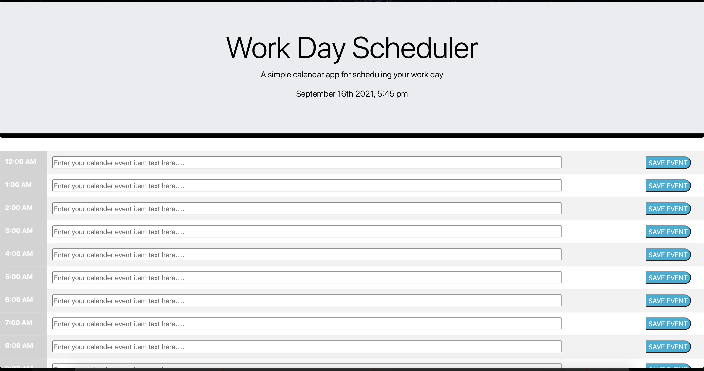

## 05-Homework

Day Plannerr APP

## Descripion:
The following homework asignment is a day planner that gives current date and time, and color codes Past Present and Future time slots with css styling.
This app also incoperates the newly leared moment() function and utalized persistent local storage. When the user clicks on a time slot their text will be saved
even after the page is loaded or refreshed. The user can also overwrite existing data at any time by resubmitting text.

Link to repo: https://github.com/jdesgarennes/05-Homework

